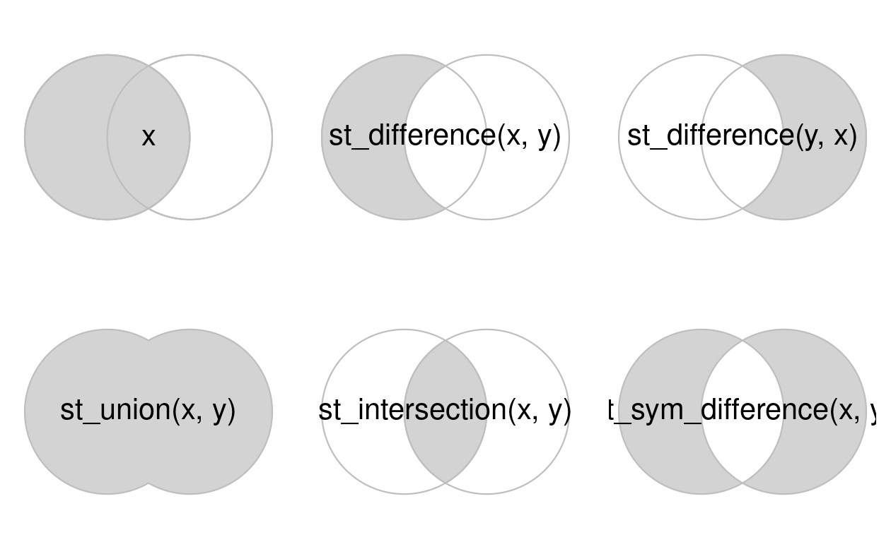

```{r setup, include=FALSE}
knitr::opts_chunk$set(echo = TRUE)
```

```{r}
library(sf)
library(dplyr)
library(spData)
library(tmap)
```

# Geometry Operations - Vectors

## Simplification

```{r}
plot(seine)
```

```{r}
seine_simp = st_simplify(seine, dTolerance = 2000) # in meters
plot(seine_simp)
```

```{r}
object.size(seine)
object.size(seine_simp)
```

```{r}
plot(us_states["AREA"])
```

```{r}
us_states_simp1 = st_simplify(us_states, dTolerance = 100000)
plot(us_states_simp1["AREA"])
```

> Alternatively, use `rmapshaper()`

```{r}
us_states_simp2 = rmapshaper::ms_simplify(us_states, 
                                          keep = 0.01, 
                                          keep_shapes = T)
plot(us_states_simp2["AREA"])
```

## Centroids

```{r}
nz_centroid = st_centroid(nz)
seine_centroid = st_centroid(seine)
```

> To ensure the point is on the parent object, use `st_point_on_surface()`

```{r}
plot(seine)
plot(seine_centroid, add = T)
```

```{r}
nz_pos = st_point_on_surface(nz)
seine_pos = st_point_on_surface(seine)
```

```{r}
p_centr1 = tm_shape(nz) +
  tm_polygons(col = "gray80", fill = "grey90") +
  tm_shape(nz_centroid) +
  tm_symbols(shape = 1, col = "black", size = 0.5) +
  tm_shape(nz_pos) +
  tm_symbols(shape = 1, col = "red", size = 0.5) +
  tm_layout(scale = 1.6)

p_centr2 = tm_shape(seine) + 
  tm_lines(col = "grey80") +
  tm_shape(seine_centroid) +
  tm_symbols(shape = 1, col = "black", size = 0.5) +
  tm_shape(seine_pos) +
  tm_symbols(shape = 1, col = "red", size = 0.5) +
  tm_add_legend(type = "symbols", shape = 1,
            col = c("black", "red"), 
            labels = c("Centroid", "Point on surface")) +
  tm_layout(scale = 1.6)

tmap_arrange(p_centr1, p_centr2, ncol = 2)
```

## Buffers

```{r}
seine_buff_5km = st_buffer(seine, dist = 5000)
seine_buff_50km = st_buffer(seine, dist = 50000)
```

```{r}
p_buff1 = tm_shape(seine_buff_5km) +
  tm_polygons(fill = "name") +
  tm_shape(seine) + tm_lines() +
  tm_title("5 km buffer") +
  tm_layout(legend.show = F)
p_buff2 = tm_shape(seine_buff_50km) +
  tm_polygons(fill = "name") +
  tm_shape(seine) + tm_lines() +
  tm_title("5 km buffer") +
  tm_layout(legend.show = F)
tmap_arrange(p_buff1, p_buff2, ncol = 2)
```

## Affine transformations

> Shift, scale, rotate

```{r}
nz_sfc = st_geometry(nz)
```

> Shift y-coordinates 100km north

```{r}
nz_shift = nz_sfc + c(0, 1e5)
```

Local scaling treats geometries independently and requires points around which geometries are going to be scaled, e.g., centroids. In the example below, each geometry is shrunk by a factor of two around the centroids (Figure [5.5](https://r.geocompx.org/geometry-operations#fig:affine-trans), middle panel). To achieve that, each object is firstly shifted in a way that its center has coordinates of `0, 0` (`(nz_sfc - nz_centroid_sfc)`). Next, the sizes of the geometries are reduced by half (`* 0.5`). Finally, each object's centroid is moved back to the input data coordinates (`+ nz_centroid_sfc`).

```{r}
nz_centroid_sfc = st_centroid(nz_sfc)
nz_scale = (nz_sfc - nz_centroid_sfc) * 0.5 + nz_centroid_sfc
```

Rotation of two-dimensional coordinates requires a rotation matrix:

$$
R=
\begin{pmatrix}
\cos\theta & -\sin\theta \\
\sin\theta & \cos\theta
\end{pmatrix}
$$

It rotates points in a clockwise direction. The rotation matrix can be implemented in R as:

```{r}
rotation = function(a){
  r = a * pi / 180
  matrix(c(cos(r), sin(r), -sin(r), cos(r)), nrow = 2, ncol = 2)
}
```

```{r}
nz_rotate = (nz_sfc - nz_centroid_sfc) * rotation(30) + nz_centroid_sfc
```

```{r}
st_crs(nz_shift) = st_crs(nz_sfc)
st_crs(nz_scale) = st_crs(nz_sfc)
st_crs(nz_rotate) = st_crs(nz_sfc)
```

```{r}
p_at1 = tm_shape(nz_sfc) + tm_polygons() +
  tm_shape(nz_shift) + tm_polygons(fill = "red") +
  tm_title("Shift")
p_at2 = tm_shape(nz_sfc) + tm_polygons() +
  tm_shape(nz_scale) + tm_polygons(fill = "red") +
  tm_title("Scale")
p_at3 = tm_shape(nz_sfc) + tm_polygons() +
  tm_shape(nz_rotate) + tm_polygons(fill = "red") +
  tm_title("Rotate")
tmap_arrange(p_at1, p_at2, p_at3, ncol = 3)
```

## Clipping

> Create 2 overlapping circles with $r=1$ and the centers 1 unit apart

```{r}
b = st_sfc(st_point(c(0,1)), st_point(c(1,1)))
b = st_buffer(b, dist = 1)
plot(b, border = "grey")
text(x = c(-0.5, 1.5), y = 1, labels = c("x", "y"), cex = 3)
```

> select the space covered by both x and y

```{r}
x = b[1]
y = b[2]
x_and_y = st_intersection(x, y)
plot(b, border = "grey")
plot(x_and_y, add = T, col = "lightgrey", border = "black")
```



## Subsetting and clipping

```{r}
bb = st_bbox(st_union(x, y))
box = st_as_sfc(bb)
set.seed(2024)
p = st_sample(x = box, size = 10)
p_xy1 = p[x_and_y]
plot(box, border = "gray", lty = 2)
plot(x, add = T, border = "grey")
plot(y, add = T, border = "grey")
plot(p, add = T, cex = 3.5)
plot(p_xy1, add = T, cex = 5, col = "red")
text(x = c(-0.5, 1.5), y = 1, labels = c("x", "y"), cex = 3)
```

> Three ways to find the common point

```{r}
x_and_y = st_intersection(x, y)

p_xy1 = p[x_and_y]
p_xy2 = st_intersection(p, x_and_y)

sel_p_xy = st_intersects(p, x, sparse = F)[, 1] & 
  st_intersects(p, y, sparse = F)[, 1]
p_xy3 = p[sel_p_xy]
                

```

## Unions

```{r}
regions = aggregate(x = us_states[,"total_pop_15"], 
                    by = list(us_states$REGION), 
                    FUN = sum, na.rm = T)
regions2 = us_states |> 
  group_by(REGION) |> 
  summarise(pop = sum(total_pop_15, na.rm = T))
```

```{r}
us_state_facet = select(us_states, REGION, total_pop_15) |> 
  mutate(Level = "State")
regions_facet = dplyr::rename(regions, REGION = Group.1) |> 
  mutate(Level = "Region")
us_facet = rbind(us_state_facet, regions_facet) |> 
  mutate(Level = factor(Level, levels = c("State", "Region"))) |> 
  st_cast("MULTIPOLYGON")

tm_shape(us_facet) + 
  tm_polygons("total_pop_15", fill.legend = tm_legend("Total population")) +
  tm_facets(by = "Level", ncol = 2, drop.units = T)
```

```{r}
us_west = us_states[us_states$REGION == "West", ]
us_west_union = st_union(us_west)
texas = us_states[us_states$NAME == "Texas", ]
texas_union = st_union(us_west_union, texas)
```

## Type transformations

> casting

```{r}
multipoint = st_multipoint(matrix(c(1, 3, 5, 1, 3, 1), ncol = 2))
```

```{r}
linestring = st_cast(multipoint, "LINESTRING")
polyg = st_cast(multipoint, "POLYGON")
```

```{r}
p_sc1 = tm_shape(st_sfc(multipoint, crs = "+proj=merc")) + 
  tm_symbols(shape = 1, col = "black", size = 0.5) +
  tm_title("MULTIPOINT") +
  tm_layout(inner.margins = c(0.15, 0.05, 0.15, 0.05))
p_sc2 = tm_shape(st_sfc(linestring, crs = "+proj=merc")) + 
  tm_lines() +
  tm_title("LINESTRING") +
  tm_layout(inner.margins = c(0.15, 0.05, 0.15, 0.05))
p_sc3 = tm_shape(st_sfc(polyg, crs = "+proj=merc")) + 
  tm_polygons(col = "black") +
  tm_title("POLYGON") +
  tm_layout(inner.margins = c(0.15, 0.05, 0.15, 0.05))
tmap_arrange(p_sc1, p_sc2, p_sc3, ncol = 3)
```

```{r}
multilinestring_list = list(matrix(c(1, 4, 5, 3), ncol = 2), 
                            matrix(c(4, 4, 4, 1), ncol = 2),
                            matrix(c(2, 4, 2, 2), ncol = 2))
multilinestring = st_multilinestring(multilinestring_list)
multilinestring_sf = st_sf(geom = st_sfc(multilinestring))
multilinestring_sf
```

```{r}
linestring_sf2 = st_cast(multilinestring_sf, "LINESTRING")
linestring_sf2
```

```{r}
linestring_sf2$name = c("Riddle Rd", "Marshall Ave", "Foulke St")
linestring_sf2$length = st_length(linestring_sf2)
linestring_sf2
```
