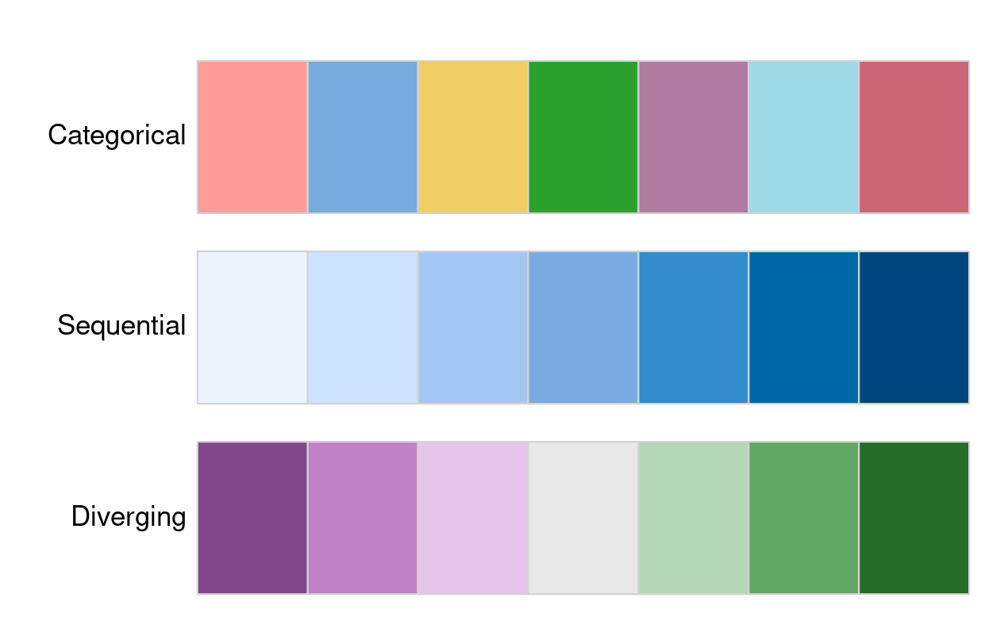

```{r setup, include=FALSE}
knitr::opts_chunk$set(echo = TRUE)
```

# Map Making

```{r}
library(sf)
library(terra)
library(dplyr)
library(spData)
library(spDataLarge)
library(tmap)
library(leaflet)
library(ggplot2)
```

```{r}
nz_elev = rast(system.file("raster/nz_elev.tif", 
                           package = "spDataLarge"))
```

## Objects

```{r}
# Add fill layer to nz shape
ex1 = tm_shape(nz) +
  tm_fill() 
# Add border layer to nz shape
ex2 = tm_shape(nz) +
  tm_borders() 
# Add fill and border layers to nz shape
ex3 = tm_shape(nz) +
  tm_fill() +
  tm_borders() 
tmap_arrange(ex1, ex2, ex3, ncol = 3)
```

-   [`tm_fill()`](https://r-tmap.github.io/tmap/reference/tm_polygons.html): shaded areas for (multi)polygons
-   [`tm_borders()`](https://r-tmap.github.io/tmap/reference/tm_polygons.html): border outlines for (multi)polygons
-   [`tm_polygons()`](https://r-tmap.github.io/tmap/reference/tm_polygons.html): both, shaded areas and border outlines for (multi)polygons
-   [`tm_lines()`](https://r-tmap.github.io/tmap/reference/tm_lines.html): lines for (multi)linestrings
-   [`tm_symbols()`](https://r-tmap.github.io/tmap/reference/tm_symbols.html): symbols for (multi)points, (multi)linestrings, and (multi)polygons
-   [`tm_raster()`](https://r-tmap.github.io/tmap/reference/tm_raster.html): colored cells of raster data (there is also [`tm_rgb()`](https://r-tmap.github.io/tmap/reference/tm_rgb.html) for rasters with three layers)
-   [`tm_text()`](https://r-tmap.github.io/tmap/reference/tm_text.html): text information for (multi)points, (multi)linestrings, and (multi)polygons

```{r}
map_nz = tm_shape(nz) + tm_polygons()
class(map_nz)
```

```{r}
map_nz1 = map_nz + 
  tm_shape(nz_elev) +
  tm_raster(col_alpha = 0.7)
```

> Buffer border lines

```{r}
nz_water = st_union(nz) |> 
  st_buffer(22200) |> 
  st_cast(to = "LINESTRING")
map_nz2 = map_nz1 + 
  tm_shape(nz_water) +
  tm_lines()
```

> Points

```{r}
map_nz3 = map_nz2 + 
  tm_shape(nz_height) +
  tm_symbols()
```

```{r}
tmap_arrange(map_nz1, map_nz2, map_nz3)
```

## Visual Variables

-   `fill`: fill color of a polygon
-   `col`: color of a polygon border, line, point, or raster
-   `lwd`: line width
-   `lty`: line type
-   `size`: size of a symbol
-   `shape`: shape of a symbol

```{r}
ma1 = tm_shape(nz) + tm_polygons(fill = "red")
ma2 = tm_shape(nz) + tm_polygons(fill = "red", fill_alpha = 0.3)
ma3 = tm_shape(nz) + tm_polygons(col = "blue")
ma4 = tm_shape(nz) + tm_polygons(lwd = 3)
ma5 = tm_shape(nz) + tm_polygons(lty = 2)
ma6 = tm_shape(nz) + tm_polygons(fill = "red", fill_alpha = 0.3,
                                 col = "blue", lwd = 3, lty = 2)
tmap_arrange(ma1, ma2, ma3, ma4, ma5, ma6)
```

> R plotting can take a variable directly, tmap requires a string

```{r}
plot(st_geometry(nz), col = nz$Land_area)  # works
#tm_shape(nz) + tm_fill(fill = nz$Land_area) # fails
#> Error: palette should be a character value
```

```{r}
plot(nz["Land_area"])
```

```{r}
tm_shape(nz) + tm_fill(fill = "Land_area")
```

> Each visual variable has three related additional arguments, with suffixes of - -
>
> -   `.scale`
>
> -   `.legend`
>
> -   `.free`.
>
>     For example, the [`tm_fill()`](https://r-tmap.github.io/tmap/reference/tm_polygons.html) function has arguments such as
>
> -   `fill`
>
> -   `fill.scale`
>
> -   `fill.legend`
>
> -   `fill.free`
>
>     The `.scale` argument determines how the provided values are represented on the map and in the legend The `.legend` argument is used to customize the legend settings, such as its title, orientation, or position The `.free` argument is relevant only for maps with many facets to determine if each facet has the same or different scale and legend.

## Scales

By default, the used scale is [`tm_scale()`](https://r-tmap.github.io/tmap/reference/tm_scale.html), which selects the visual settings automatically given by the input data type (factor, numeric, and integer).

-   The default setting uses 'pretty' breaks, described in the next paragraph
-   `breaks` allows you to manually set the breaks
-   `n` sets the number of bins into which numeric variables are categorized
-   `values` defines the color scheme, for example, `BuGn`

```{r}
mi1 = tm_shape(nz) + tm_polygons(fill = "Median_income")
mi2 = tm_shape(nz) + tm_polygons(fill = "Median_income",
                        fill.scale = tm_scale(breaks = c(0, 30000, 40000, 50000)))
mi3 = tm_shape(nz) + tm_polygons(fill = "Median_income",
                           fill.scale = tm_scale(n = 10))
mi4 = tm_shape(nz) + tm_polygons(fill = "Median_income",
                           fill.scale = tm_scale(values = "brewer.bu_gn"))
tmap_arrange(mi1, mi2, mi3, mi4, nrow = 2)
```

> [`tm_scale_intervals()`](https://r-tmap.github.io/tmap/reference/tm_scale_intervals.html), [`tm_scale_continuous()`](https://r-tmap.github.io/tmap/reference/tm_scale_continuous.html), and [`tm_scale_categorical()`](https://r-tmap.github.io/tmap/reference/tm_scale_categorical.html).

```{r}
#| eval: false
tm_shape(nz) + tm_fill(fill = "Land_area", fill.scale = tm_scale_intervals())
tm_shape(nz) + tm_fill(fill = "Land_area", fill.scale = tm_scale_continuous())
tm_shape(nz) + tm_fill(fill = "Land_area", fill.scale = tm_scale_categorical())
tm_shape(nz) + tm_fill(fill = "Land_area", fill.scale = tm_scale_continuous_log())
tm_shape(nz) + tm_fill(fill = "Land_area", fill.scale = tm_scale_continuous_log1p())
tm_shape(nz) + tm_fill(fill = "Land_area", fill.scale = tm_scale_discrete())
tm_shape(nz) + tm_fill(fill = "Land_area", fill.scale = tm_scale_ordinal())
tm_shape(nz) + tm_fill(fill = "Land_area", fill.scale = tm_scale_rgb())
tm_shape(nz) + tm_fill(fill = "Land_area", fill.scale = tm_scale_continuous())
tm_shape(nz) + tm_symbols(size = "Land_area", size.scale = tm_scale_intervals())
```

-   `style = "equal"`: divides input values into bins of equal range and is appropriate for variables with a uniform distribution (not recommended for variables with a skewed distribution as the resulting map may end up having little color diversity)
-   `style = "quantile"`: ensures the same number of observations fall into each category (with the potential downside that bin ranges can vary widely)
-   `style = "jenks"`: identifies groups of similar values in the data and maximizes the differences between categories
-   `style = "log10_pretty"`: a common logarithmic (the logarithm to base 10) version of the regular pretty style used for variables with a right-skewed distribution

```{r}
m_equal = tm_shape(nz) +
  tm_polygons(fill = "Median_income", 
              fill.scale = tm_scale_intervals(style = "equal")) +
  tm_title('style = "equal"') +
  tm_layout(legend.position = tm_pos_auto_in(), 
            title.position = tm_pos_in("right", "bottom"), 
            scale = 0.8, 
            inner.margins = c(0.15, 0.35, 0.02, 0.02))
m_pretty = tm_shape(nz) +
  tm_polygons(fill = "Median_income", 
              fill.scale = tm_scale_intervals(style = "pretty")) +
  tm_title('style = "pretty"') +
  tm_layout(legend.position = tm_pos_auto_in(), 
            title.position = tm_pos_in("right", "bottom"), 
            scale = 0.8, 
            inner.margins = c(0.15, 0.35, 0.02, 0.02))    
m_quantile = tm_shape(nz) +
  tm_polygons(fill = "Median_income", 
              fill.scale = tm_scale_intervals(style = "quantile")) +          tm_title('style = "quantile"')+
  tm_layout(legend.position = tm_pos_auto_in(), 
            title.position = tm_pos_in("right", "bottom"), 
            scale = 0.8, 
            inner.margins = c(0.15, 0.35, 0.02, 0.02))
m_jenks = tm_shape(nz) +
  tm_polygons(fill = "Median_income", 
              fill.scale = tm_scale_intervals(style = "jenks")) +
  tm_title('style = "jenks"') +
  tm_layout(legend.position = tm_pos_auto_in(), 
            title.position = tm_pos_in("right", "bottom"), 
            scale = 0.8, 
            inner.margins = c(0.15, 0.35, 0.02, 0.02))
m_log10 = tm_shape(nz) +
  tm_polygons(fill = "Population", 
              fill.scale = tm_scale_intervals(style = "log10_pretty", 
                                              values = "brewer.bu_pu")) +
  tm_title('style = "log10_pretty"')+
  tm_layout(legend.position = tm_pos_auto_in(), 
            title.position = tm_pos_in("right", "bottom"), scale = 0.8, 
            inner.margins = c(0.15, 0.35, 0.02, 0.02))

tmap_arrange(m_pretty, m_equal, m_quantile, m_jenks, m_log10, nrow = 2) 
```

```{r}
m_cont1 = tm_shape(nz) +
  tm_polygons(fill = "Median_income", fill.scale = tm_scale_continuous(n = 5)) +
  tm_title('tm_scale_continuous()', fontfamily = "monospace") +
  tm_layout(legend.position = tm_pos_auto_in(), scale = 0.9)
m_cat1 = tm_shape(nz) +
  tm_polygons(fill = "Island", fill.scale = tm_scale_categorical()) +
  tm_title('tm_scale_categorical()', fontfamily = "monospace") +
  tm_layout(legend.position = tm_pos_auto_in(), scale = 0.9)
tmap_arrange(m_cont1, m_cat1)
```

## Palettes

```{r}
ex1 = tm_shape(nz) + 
  tm_polygons("Median_income", 
              fill.scale = tm_scale(values = "brewer.greens"))
ex2 = tm_shape(nz) + 
  tm_polygons("Median_income", 
              fill.scale = tm_scale(values = "brewer.yl_gn_bu"))
tmap_arrange(ex1, ex2)
```

> Divergent

```{r}
tm_shape(nz) + 
  tm_polygons("Median_income",
              fill.scale = tm_scale_continuous(values = "pu_gn_div", 
                                               midpoint = 28000))
```



## Legends

```{r}
legend_title = expression("Area (km"^2*")")
ex1 = tm_shape(nz) +
  tm_polygons(fill = "Land_area", 
              fill.legend = tm_legend(title = legend_title))
ex2 = tm_shape(nz) +
  tm_polygons(fill = "Land_area",
              fill.legend = tm_legend(
                              title = legend_title,
                              orientation = "landscape",
                              position = tm_pos_out("center", "bottom")))
tmap_arrange(ex1, ex2)
```

-   [`tm_pos_out()`](https://r-tmap.github.io/tmap/reference/tm_pos.html): the default, adds the legend outside of the map frame area. We can customize its location with two values that represent the horizontal position (`"left"`, `"center"`, or `"right"`), and the vertical position (`"bottom"`, `"center"`, or `"top"`)
-   [`tm_pos_in()`](https://r-tmap.github.io/tmap/reference/tm_pos.html): puts the legend inside of the map frame area. We may decide on its position using two arguments, where the first one can be `"left"`, `"center"`, or `"right"`, and the second one can be `"bottom"`, `"center"`, or `"top"`.

## Layouts

-   [`tm_graticules()`](https://r-tmap.github.io/tmap/reference/tm_graticules.html)
-   [`tm_compass()`](https://r-tmap.github.io/tmap/reference/tm_compass.html)
-   [`tm_scalebar()`](https://r-tmap.github.io/tmap/reference/tm_scalebar.html)
-   [`tm_title()`](https://r-tmap.github.io/tmap/reference/tm_title.html)

```{r}
map_nz + 
  tm_graticules() +
  tm_compass(type = "8star", 
             position = c("left", "top")) +
  tm_scalebar(breaks = c(0, 100, 200), 
              text.size = 1, 
              position = c("left", "top")) +
  tm_title("New Zealand")
```

```{r}
ex1 = map_nz + tm_layout(scale = 4)
ex2 = map_nz + tm_layout(bg.color = "lightblue")
ex3 = map_nz + tm_layout(frame = FALSE)
tmap_arrange(ex1, ex2, ex3)
```

-   Margin settings including `inner.margin` and `outer.margin`
-   Font settings controlled by `fontface` and `fontfamily`
-   Legend settings including options such as `legend.show` (whether or not to show the legend) `legend.orientation`, `legend.position`, and `legend.frame`
-   Frame width (`frame.lwd`) and an option to allow double lines (`frame.double.line`)
-   Color settings controlling `color.sepia.intensity` (how *yellowy* the map looks) and `color.saturation` (a color-grayscale)

```{r}
map_nza = tm_shape(nz) +
  tm_fill(fill = "Land_area", 
          fill.legend = tm_legend(position = c("left", "top"), 
                                  title = legend_title)) +
  tm_borders()
c1 = map_nza +
  tm_title('frame.lwd = 5', position = c("right", "bottom")) +
  tm_layout(frame.lwd = 5, scale = 0.8) 
c2 = map_nza +
  tm_title('inner.margins = rep(0.2, 4)', position = c("right", "bottom")) +
  tm_layout(inner.margins = rep(0.2, 4), scale = 0.8)
c3 = map_nza +
  tm_title('legend.show = FALSE', position = c("right", "bottom")) + 
  tm_layout(legend.show = FALSE, scale = 0.8)
c4 = tm_shape(nz) +
  tm_fill(fill = "Land_area") +
  tm_borders() +
  tm_title('legend.position =\n c("right", "bottom")', position = c("left", "top")) +
  tm_layout(legend.position = c("right", "bottom"), scale = 0.8)
tmap_arrange(c1, c2, c3, c4, nrow = 2)
```

## Faceted maps

```{r}
urb_1970_2030 = urban_agglomerations |> 
  filter(year %in% c(1970, 1990, 2010, 2030))

tm_shape(world) + 
  tm_polygons() +
  tm_shape(urb_1970_2030) +
  tm_symbols(fill = "black", col = "white", 
             size = "population_millions") +
  tm_facets_wrap(by = "year", nrow = 2) +
  tm_crs("auto")
```

## Inset maps

In the example below, we create a map of the central part of New Zealand\'s Southern Alps. Our inset map will show where the main map is in relation to the whole New Zealand. The first step is to define the area of interest, which can be done by creating a new spatial object, `nz_region`.

```{r}
nz_region = st_bbox(c(xmin = 1340000, xmax = 1450000, 
                      ymin = 5130000, ymax = 5210000), 
                    crs = st_crs(nz_height)) |> 
  st_as_sfc()
```

In the second step, we create a base-map showing New Zealand\'s Southern Alps area. This is a place where the most important message is stated.

```{r}
nz_height_map = tm_shape(nz_elev, bbox = nz_region) +
  tm_raster(col.scale = tm_scale_continuous(values = "brewer.yl_gn"), 
            col.legend = tm_legend(position = c("left", "top"))) +
  tm_shape(nz_height) +
  tm_symbols(shape = 2, col = "red", size = 1) +
  tm_scalebar(position = c("left", "bottom"))
nz_height_map
```

The third step consists of the inset map creation. It gives a context and helps to locate the area of interest. Importantly, this map needs to clearly indicate the location of the main map, for example by stating its borders.

```{r}
nz_map = tm_shape(nz) + tm_polygons() +
  tm_shape(nz_height) + tm_symbols(shape = 2, col = "red", size = 0.1) +
  tm_shape(nz_region) + tm_borders(lwd = 3) +
  tm_layout(bg.color = "lightblue")
nz_map
```

We need to calculate the aspect ratios of our two main datasets, `nz_region` and `nz`. The following function, `norm_dim()` returns the normalized width (`"w"`) and height (`"h"`) of the object (as `"snpc"` units understood by the graphic device).

```{r}
library(grid)
norm_dim = function(obj){
    bbox = st_bbox(obj)
    width = bbox[["xmax"]] - bbox[["xmin"]]
    height = bbox[["ymax"]] - bbox[["ymin"]]
    w = width / max(width, height)
    h = height / max(width, height)
    return(unit(c(w, h), "snpc"))
}
main_dim = norm_dim(nz_region)
ins_dim = norm_dim(nz)
```

Next, knowing the aspect ratios, we need to specify the sizes and locations of our two maps -- the main map and the inset map -- using the [`viewport()`](https://rdrr.io/r/grid/viewport.html) function. A viewport is part of a graphics device we use to draw the graphical elements at a given moment. The viewport of our main map is just the representation of its aspect ratio.

```{r}
main_vp = viewport(width = main_dim[1], height = main_dim[2])
```

On the other hand, the viewport of the inset map needs to specify its size and location. Here, we would make the inset map twice smaller as the main one by multiplying the width and height by 0.5, and we will locate it 0.5 cm from the bottom right of the main map frame.

```{r}
ins_vp = viewport(width = ins_dim[1] * 0.5, 
                  height = ins_dim[2] * 0.5, 
                  x = unit(1, "npc") - unit(0.5, "cm"), 
                  y = unit(0.5, "cm"), 
                  just = c("right", "bottom"))
```

```{r}
grid.newpage()
print(nz_height_map, vp = main_vp)
pushViewport(main_vp)
print(nz_map, vp = ins_vp)
```

Inset maps are also used to create one map of non-contiguous areas. Probably, the most often used example is a map of the United States, which consists of the contiguous United States, Hawaii and Alaska. It is very important to find the best projection for each individual inset in these types of cases (see Chapter [7](https://r.geocompx.org/reproj-geo-data#reproj-geo-data) to learn more). We can use US National Atlas Equal Area for the map of the contiguous United States by putting its EPSG code in the `crs` argument of [`tm_shape()`](https://r-tmap.github.io/tmap/reference/tm_shape.html).

```{r}
us_states_map = tm_shape(us_states, crs = "EPSG:9311") +
  tm_polygons() +
  tm_layout(frame = F)
hawaii_map = tm_shape(hawaii) +
  tm_polygons() + 
  tm_title("Hawaii") +
  tm_layout(frame = FALSE, bg.color = NA, 
            title.position = c("LEFT", "BOTTOM"))
alaska_map = tm_shape(alaska) +
  tm_polygons() + 
  tm_title("Alaska") +
  tm_layout(frame = FALSE, bg.color = NA)
```

```{r}
us_states_map
print(hawaii_map, 
      vp = grid::viewport(0.35, 0.1, width = 0.2, height = 0.1))
print(alaska_map, 
      vp = grid::viewport(0.15, 0.15, width = 0.3, height = 0.3))
```
