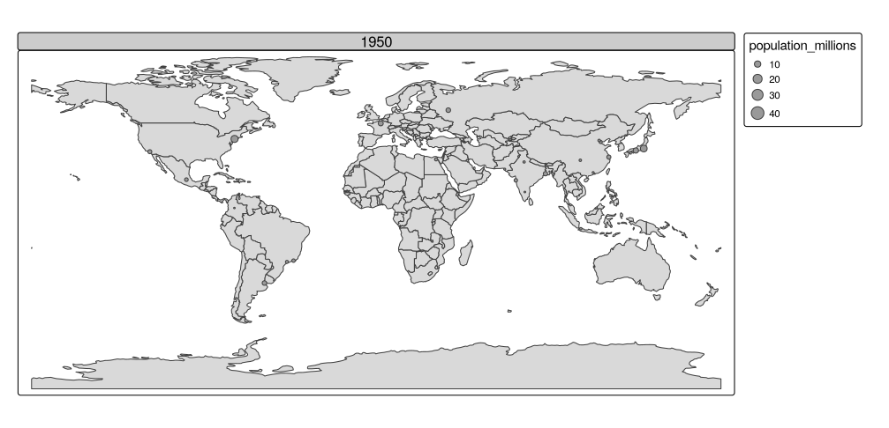
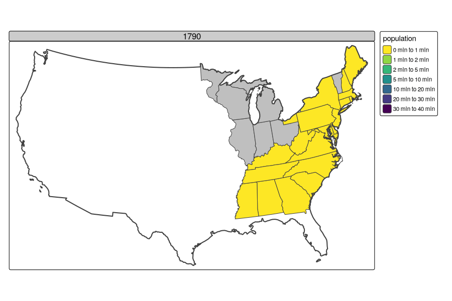

```{r setup, include=FALSE}
knitr::opts_chunk$set(echo = TRUE)
```

# Map Making Animated

```{r}
library(sf)
library(terra)
library(dplyr)
library(spData)
library(spDataLarge)
library(tmap)
library(leaflet)
library(ggplot2)
```

There are two differences, however, related to arguments in [`tm_facets_wrap()`](https://r-tmap.github.io/tmap/reference/tm_facets.html):

-   `nrow = 1, ncol = 1` are added to keep one moment in time as one layer
-   `free.coords = FALSE`, which maintains the map extent for each map iteration

```{r}
urb_anim = tm_shape(world) + tm_polygons() + 
  tm_shape(urban_agglomerations) + 
  tm_symbols(size = "population_millions") +
  tm_facets_wrap(by = "year", nrow = 1, ncol = 1, free.coords = FALSE)
```

```{r}
tmap_animation(urb_anim, filename = "urb_anim.gif", delay = 25)
```



```{r}
library(USAboundaries)
library(tidyverse)
library(USAboundariesData)
```

```{r}

```

```{r}
dates = paste(historydata::us_state_populations$year, "01", "01", sep = "-")
dates_unique = unique(dates)
# select all dates earlier than 2000 after this error:
#   Error in us_states(map_date, resolution, states) : 
#   map_date <= as.Date("2000-12-31") is not TRUE
dates_unique = dates_unique[dates_unique <= "2000-12-31"]
usb1 = USAboundaries::us_states(map_date = dates_unique[1])
usb1$year = lubridate::year(dates_unique[1])
plot(usb1$geometry)
usbl = map(dates_unique, ~USAboundaries::us_states(map_date = .))
# usb = do.call(rbind, usbl)
statepop = historydata::us_state_populations |>
  select(-GISJOIN) |> rename(name = state) 
sel = usb1$name %in% statepop$name
summary(sel)
usb1$name[!sel]
usbj = left_join(usb1, statepop)
plot(usbj["population"])
i = 2

dates_unique[dates_unique > "2000-12-31"] = "2000-12-31"

for(i in 2:length(dates_unique)) {
  usbi = USAboundaries::us_states(map_date = dates_unique[i])
  #print(st_crs(usbi))
  usbi$year = lubridate::year(dates_unique[i])
  if (dates_unique[i] == "2000-12-31") usbi$year = 2010
  # plot(usbi$geometry)
  usbji = left_join(usbi, statepop)
  # plot(usbji["population"])
  usbj = bind_rows(usbj, usbji)
}

summary(usbj)
usa_contig = usbji[!grepl(pattern = "Alaska|Haw", usbji$name), ]

usbj_contig9311 = st_intersection(usbj, usa_contig[0]) |>
  st_transform("EPSG:9311") |> 
  st_collection_extract("POLYGON")

pal = viridis::viridis(n = 7, direction = -1)
pb = c(0, 1, 2, 5, 10, 20, 30, 40) * 1e6
facet_anim = tm_shape(usbj_contig9311) +
  tm_polygons(fill = "population",
              fill.scale = tm_scale(values = pal, breaks = pb, label.na = FALSE)) +
  tm_facets(by = "year", nrow = 1, ncol = 1, free.coords = FALSE) +
  tm_shape(st_union(us_states)) + tm_borders(lwd = 2)
tmap_animation(tm = facet_anim, filename = "09-us_pop.gif", width = 900, height = 600)
```


